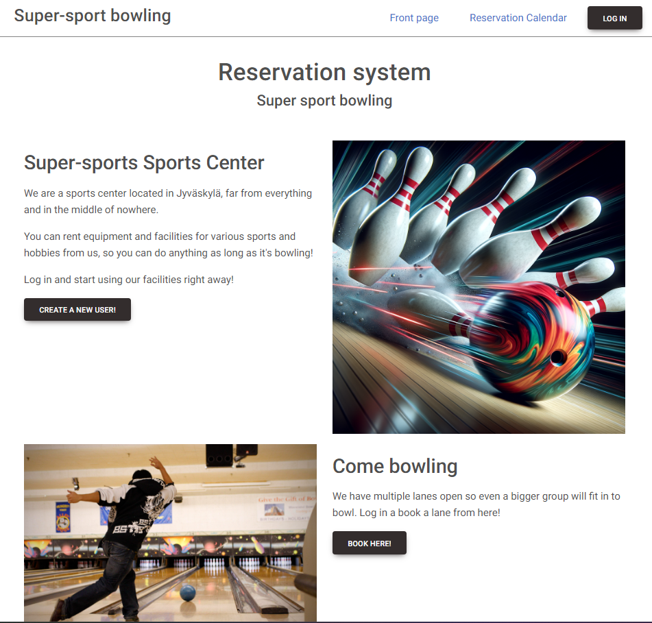
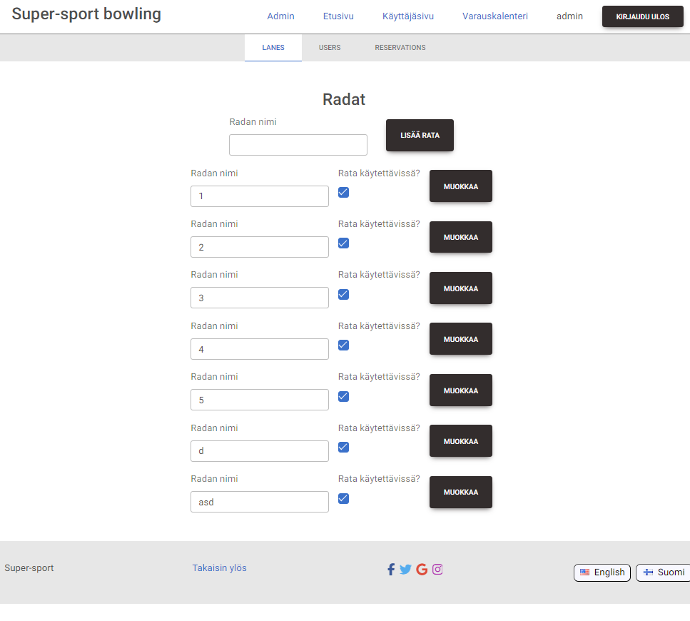
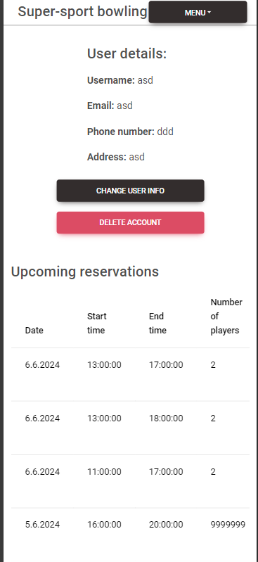

# reservation-system - Super-sports bowling

## Description

This is a web app project of a reservation system to a nonexistent bowling sports center "super-sport" (no relation to any real company with the same name).

The aim of the project is to create a functional front end, back end and database to let users reserve time slots to different bowling lanes. To make that happen the user needs to first create an account and log in. On top of those features the app has the usual web page features like a front page which has information about the sports center and a userpage where the user can change their info and see their past and future reservations listed.

Both the front and back end code use TypeScript and are made with the Node package manager (npm). The front end works on a vite react project using TypeScript + SWC compiler. The back end uses an express server and runs on a node server. The database was built for a postgres sql database. The styling of the web-pages is done mainly with Bootstrap but we also made some of our own css stylings.

### Here is an example image of the reservation calendar

## backend endpoints

### /bowling/ router

-   GET /bowling/ returns all the lanes in the database
-   GET /bowling/:id requires a lane by the id given
-   GET /bowling/date/:date returns the state of the lanes for the given day
-   POST /bowling/create adds a lane with the information given in the post data. Requires authentication as an administrator.
-   DELETE /bowling/:id deletes a lane by the given id. Requires authentication as an administrator.
-   PUT /bowling/:id modifies the lanes data. Requires authentication as an administrator.

### /user/ router

-   GET /user/ Gets all users. Requires admin authentication.
-   GET /user/:id Gets the users info. requires user level authentication
-   POST /user/ Creates a new user. needs "username, password, email, phone_number and address"
-   POST /login/ logs the user in, requires email and password. returns a token to authenticate the user
-   DELETE /user/:id deletes the user, requires authentication.
-   PUT /user/:id changes any of the users information, requires authentication
-   GET /user/token/:token verifys the users json web token for authentication purposes
-   GET /user/:id/reservations returns the users reservations

### /reservations/ router

-   GET /reservations/ finds and returns all reservations
-   GET /reservations/:id returns a reservation by the id
-   POST /reservations/create creates a new reseration, requires "user_id, lane_id, date, start_time, end_time, amount_of_players, additional_info"
-   DELETE /reservations/:id deletes a reservation by the given id
-   PUT /reservations/:id edits the reservation info. used for changing additional information on the user page.

### mobile view of the user page

## Installation

To use this project download the contents and run npm install on both front-end and back-end folders to install the required dependencies. You also need to install postgres sql https://www.postgresql.org/ and create a database for the project, and create an ENV file in the back-end folder that includes PORT, SECRET and PG_HOST, PG_PORT, PG_USERNAME, PG_PASSWORD, PG_DATABASE envs for your database. You can also run npm build on the front-end and tlc -b in the back-end to make a build out of the project folders.

## Support

To get help for this project message one of the creators here on Gitlab.

## Roadmap

There are currently no future plans to develop this project further.

## Authors and acknowledgment

The creators of this project are @PekkaKalpio @SauliHa @WinterCivilian and @lpaukkala. We made this project as a reference to show our technical skills and ability to work in a team.

We would like to thank everyone who has worked with all the modules and tools used in this project.

## License

For open source projects, say how it is licensed.

## Project status

The project is finished in it's current state.
